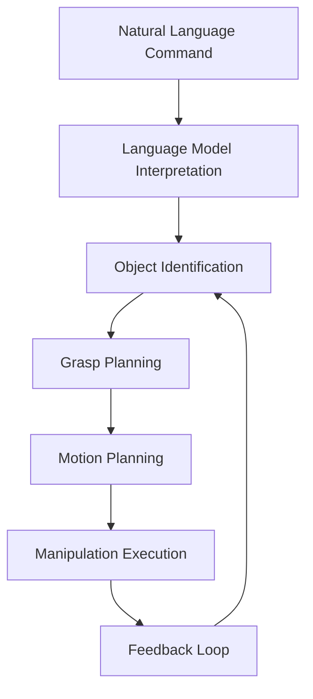

# Manipulation Control in VLA Systems

## Introduction

Manipulation control is a critical component of Vision-Language-Action (VLA) systems for humanoid robots. This chapter explores how VLA systems interpret natural language commands to control the robot's manipulator arms and grippers, enabling complex manipulation tasks in unstructured environments.

## Core Concepts

### Understanding Manipulation Commands

When a VLA system receives a manipulation command through voice or text, it must:

1. Parse the semantic meaning of the action (grasp, lift, move, place, etc.)
2. Identify the target object(s) in the environment
3. Determine the precise pose and trajectory required for manipulation
4. Execute the manipulation sequence while adapting to environmental constraints

### Integration with Perception

Manipulation control heavily relies on:

- Real-time object detection and pose estimation
- Grasp affordance prediction
- Collision avoidance during motion planning
- Force/torque feedback for compliant manipulation

## Implementation Architecture

### Language-to-Manipulation Pipeline



The pipeline creates a closed loop where manipulation actions can be refined based on real-world outcomes and environmental feedback.

### Control Strategies

#### 1. Trajectory-Level Control

For precise manipulation tasks, VLA systems often generate joint-space or Cartesian trajectories:

```python
def generate_manipulation_trajectory(command, target_object):
    """
    Generates manipulation trajectory based on natural language command
    and perceived target object properties
    """
    grasp_config = predict_grasp_configuration(target_object.shape)
    approach_vector = calculate_approach_direction(target_object.pose, grasp_config)
    
    # Generate smooth trajectory with intermediate waypoints
    trajectory = create_trajectory_with_waypoints(
        current_pose=get_current_ee_pose(),
        approach_pose=calculate_approach_pose(target_object.pose, approach_vector),
        grasp_pose=calculate_grasp_pose(target_object.pose, grasp_config),
        lift_pose=calculate_lift_pose(target_object.pose),
        place_pose=parse_place_location(command)
    )
    
    return trajectory
```

#### 2. Compliance Control

Humanoid robots need to exhibit appropriate compliance during manipulation to handle uncertainties:

```python
def execute_compliant_manipulation(trajectory, force_threshold=5.0):
    """
    Executes manipulation with force feedback and compliance control
    """
    controller = ImpedanceController(stiffness=0.5, damping=0.7)
    
    for waypoint in trajectory:
        # Apply compliance control during approach phases
        if waypoint.phase == "APPROACH":
            controller.set_stiffness(0.3)  # Low stiffness for safe contact
        elif waypoint.phase == "GRASP":
            controller.set_stiffness(1.0)  # High stiffness for firm grasp
        
        # Monitor forces and adjust trajectory if needed
        if max_force_exceeded(force_sensors, threshold):
            handle_force_exception(waypoint, force_sensors)
        
        robot.move_to(waypoint)
```

## VLA-Specific Considerations

### Multimodal Fusion for Manipulation

VLA systems uniquely combine vision and language modalities for manipulation:

- Visual context informs grasp selection and manipulation strategy
- Language context specifies the intended outcome and constraints
- Action sequences emerge from the fusion of both modalities

### Handling Ambiguity

Natural language manipulation commands often contain ambiguities:

- "Put the red cup on the table" - which table? which red cup?
- "Lift the box carefully" - how carefully?
- "Open the drawer gently" - define gentle?

VLA systems address these through:

- Active querying when ambiguities are detected
- Context-aware interpretation based on scene understanding
- Confidence scoring to determine when to defer to operator control

## Integration with Navigation

Manipulation tasks rarely happen in isolation. Integration with navigation systems enables:

- Navigation to pre-grasp positions for optimal manipulation
- Dynamic replanning when initial grasp attempts fail
- Transport of objects between different locations
- Sequencing of multiple manipulation tasks

## Challenges and Best Practices

### Robustness

- Implement fallback strategies when manipulation fails
- Maintain consistent object tracking during manipulation
- Handle unexpected contacts gracefully
- Use force control for compliant behaviors

### Scalability

- Develop reusable manipulation primitives
- Parameterize manipulation behaviors for different object types
- Integrate with high-level task planners for complex workflows

## Practical Example

Consider a humanoid robot receiving the command: "Please pick up the book from the desk and place it on the shelf."

The VLA system would:
1. Use visual perception to identify the book and its position
2. Recognize the locations of desks and shelves in the environment
3. Generate a manipulation plan for picking up the book (approach, grasp, lift)
4. Generate navigation to a suitable position for placing the book on the shelf
5. Execute the placement action with appropriate precision and compliance

The entire sequence is derived from the natural language command through the integrated VLA system.

## Conclusion

Manipulation control represents one of the most challenging aspects of VLA systems, requiring tight integration between language understanding, visual perception, and precise motor control. Well-designed VLA systems make manipulation accessible through natural language while maintaining the precision required for robotic systems.